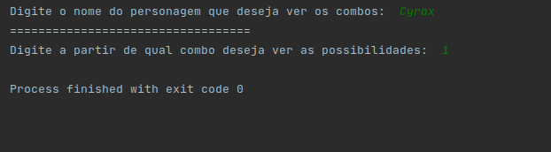
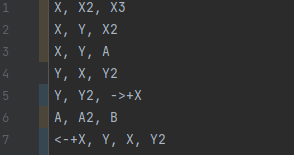
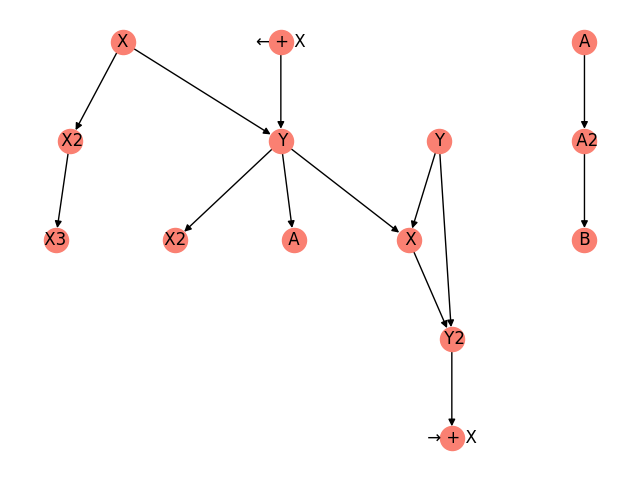
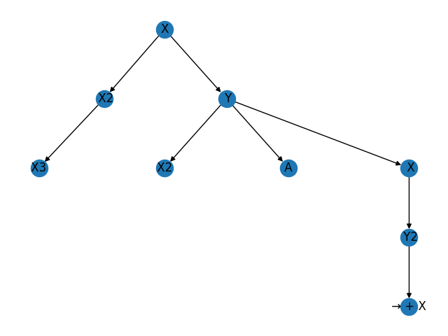

# Combo Mortal

**Número da Lista**: 1 
**Conteúdo da Disciplina**: Grafos 1 

## Alunos
|Matrícula | Aluno |
| -- | -- |
| 17/0034992  |  Gustavo Afonso Pires Severo  |
| 17/0011119  |  Geraldo Victor Alves Barbosa |

## Sobre 
O projeto tem como objetivo converter uma lista de combos de jogo de luta em um grafo de combos, de forma a representar de maneira mais compacta e fluida os movimentos possíveis para o jogador. 
[Link para apresentação](https://www.youtube.com/watch?v=YJZZbTrr7do&ab_channel=GeraldoVictor)
[Link para baixar a apresentação](https://drive.google.com/file/d/1LTUkYjGQEXLw8JDymCqGc9OfT7EwNHqd/view?usp=sharing)

## Screenshots
Mostrados na sessão de uso.

## Instalação 
**Linguagem**: Python3.8 ou superior 
**Framework**: Não foi usado 

####Bibliotecas 
- networkx
- matplotlib
- CsvDataReader

####Graphviz
Pode ser instalado usando o comando:
- sudo apt-get install graphviz

## Uso 

###1.Escolha o personagem
Após executar o programa deve-se inserir o nome de um personagem que tenha a lista de movimentos nos arquivos do projeto, as opções são:
- Cyrax
- Ermac
- Jax
- JohnnyCage
- Kitana
- Liu_Kang
- Scorpion
- Sindel
- Smoke
- Sub-zero

(caso o usuário queira mais personagens basta adicionar a lista de movimentos no formato .csv na pasta characters)

###2.Escolha o combo que deseja explorar

Após escolher o personagem escolha o número do combo voce quer uma análise aprofundada.
Por exemplo Cyrax tem 7 combos disponíveis, podemos escolher um numero entre 1 e 7

###3.Resultado da execução:

Grafo geral dos combos do Cyrax:

Grafo detalhado do primeiro combo:

## Outros 
Quaisquer outras informações sobre seu projeto podem ser descritas abaixo.

